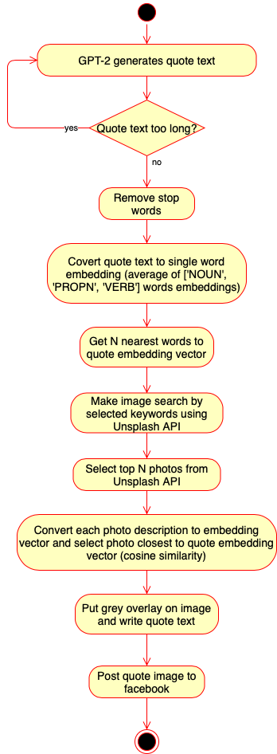

# Quote Me AI

Quote Me AI is quotes generating bot whose the only purpose is to generate unique quotes. Generated quotes are drawn onto the image and posted to subreddit [Quote Me AI subreddit](https://www.reddit.com/r/QuoteMeAI/).

## Samples

## Libraries used
* GPT-2-simple - text generation
* Unsplash API - photos search
* spacy - NLP tasks (word embeddings, similarity search)
* prow - posting quotes images to subreddit

## Workflow diagram

## How to use
* Install libraries `pip install -r requirements.txt`
* Rename `config_template.py` into `config.py` and fill unsplash and facebook and Google Drive API keys.
* Use `Quote_model_train.ipynb` to train GPT-2 model.
* Copy trained checkpoint to root path.
* Execute `python quote_me_ai.py`
